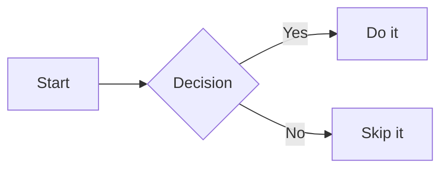

# TeppiDigital Blog

A simple blog built with Jekyll for GitHub Pages, featuring insights and updates about digital solutions from TeppiDigital.

## Overview

This repository contains a clean, modern blog layout built using Jekyll, the static site generator that powers GitHub Pages.

## Features

- 📝 Clean blog post layout
- 🎨 Modern, responsive design
- 📱 Mobile-friendly
- 🚀 Easy to deploy on GitHub Pages
- ✍️ Simple markdown-based posts

## Structure

```
.
├── _config.yml          # Jekyll configuration
├── _layouts/            # Page layouts
│   ├── default.html     # Main layout template
│   └── post.html        # Blog post layout
├── _posts/              # Blog posts organized by date
│   └── YYYY/            # Year folder
│       └── MM/          # Month folder
│           └── DD/      # Day folder
│               └── YYYY-MM-DD-title-of-post.md
├── assets/              # Static assets
│   ├── css/
│   │   └── style.css    # Stylesheet
│   └── posts/           # Post-specific media files
│       └── YYYY/MM/DD/  # Mirrors _posts date structure
│           └── images/  # Images for specific post
└── index.html           # Homepage (blog list)
```

## Adding New Posts

To add a new blog post:

1. Create a date-based folder structure: `_posts/YYYY/MM/DD/`
2. Create your post file: `_posts/YYYY/MM/DD/YYYY-MM-DD-title-of-post.md`
3. (Optional) Create a parallel media folder: `assets/posts/YYYY/MM/DD/images/`
4. Add front matter at the top of your post:

Or run command 
```bash
make new-post TITLE="My Post Title"
```

```markdown
---
layout: post
title: "Your Post Title"
date: YYYY-MM-DD HH:MM:SS +0000
---

Your content here...
```

5. Reference media files using absolute paths with the `relative_url` filter:
   ```markdown
   
   ```

### Post Organization

Posts are organized in date-based folders (YYYY/MM/DD/) with parallel media storage to:
- Keep related content logically grouped by date
- Store media files in a parallel structure under `assets/posts/`
- Maintain a clean, organized structure
- Make it easy to find and manage posts and their media by date
- Ensure Jekyll correctly serves all media files

Each post's structure:
- The post markdown file: `_posts/YYYY/MM/DD/YYYY-MM-DD-title.md`
- Associated media files: `assets/posts/YYYY/MM/DD/images/`
- Other files: `assets/posts/YYYY/MM/DD/files/` (for PDFs, downloads, etc.)

For detailed instructions, see `_posts/POST_ORGANIZATION_GUIDE.md`

## Local Development

To test the blog locally:

```bash
# Install Jekyll (one time only)
gem install jekyll bundler

# Build and serve the site
jekyll serve

# View at http://localhost:4000
```

## Deployment

This blog is automatically deployed via GitHub Pages:

1. Push your changes to the repository
2. GitHub Pages will automatically build and deploy your site
3. View your blog at `https://teppixdigital.github.io/`

## Mermaid Diagrams

Posts support [Mermaid](https://mermaid.js.org/) diagrams. To enable diagrams in a post, add `mermaid: true` to its front matter:

```markdown
---
layout: post
title: "My Post"
date: 2026-03-28 10:00:00 +0000
mermaid: true
---

Here is a diagram:


```

Mermaid JS is only loaded on pages that set `mermaid: true`, keeping other pages fast.

## Customization

- **Site title and description**: Edit `_config.yml`
- **Styling**: Modify `assets/css/style.css`
- **Layouts**: Edit files in `_layouts/`

## Google Analytics Integration

This blog includes privacy-friendly Google Analytics 4 (GA4) integration. To enable tracking:

1. **Create a GA4 Property**:
   - Go to [Google Analytics](https://analytics.google.com/)
   - Create a new GA4 property for your website
   - Get your Measurement ID (format: `G-XXXXXXXXXX`)

2. **Enable Tracking**:
   - Open `_config.yml`
   - Add your Measurement ID to the `google_analytics` field:
   ```yaml
   google_analytics: "G-XXXXXXXXXX"
   ```

3. **Privacy & Security Features**:
   - ✅ GA4 doesn't collect IP addresses by default (enhanced privacy)
   - ✅ Cross-site tracking prevention (SameSite=Lax;Secure cookies)
   - ✅ Google Signals disabled (no demographics tracking)
   - ✅ Ad personalization disabled
   - ✅ Async script loading for better performance
   - ✅ Conditional loading (only when configured)

4. **Important Notes**:
   - The `Secure` cookie flag requires HTTPS. Analytics cookies won't be set when testing locally over HTTP (http://localhost:4000), but will work correctly on the live GitHub Pages site (HTTPS).
   - If your site implements Content Security Policy (CSP), you may need to configure it to allow inline scripts for Google Analytics, or consider implementing nonce-based CSP.

4. **Disable Tracking**:
   - To disable, leave the `google_analytics` field empty in `_config.yml`

**Note**: Consider adding a privacy policy and cookie notice to your site to inform users about analytics tracking, as required by GDPR and other privacy regulations.

## License

See LICENSE file for details.

