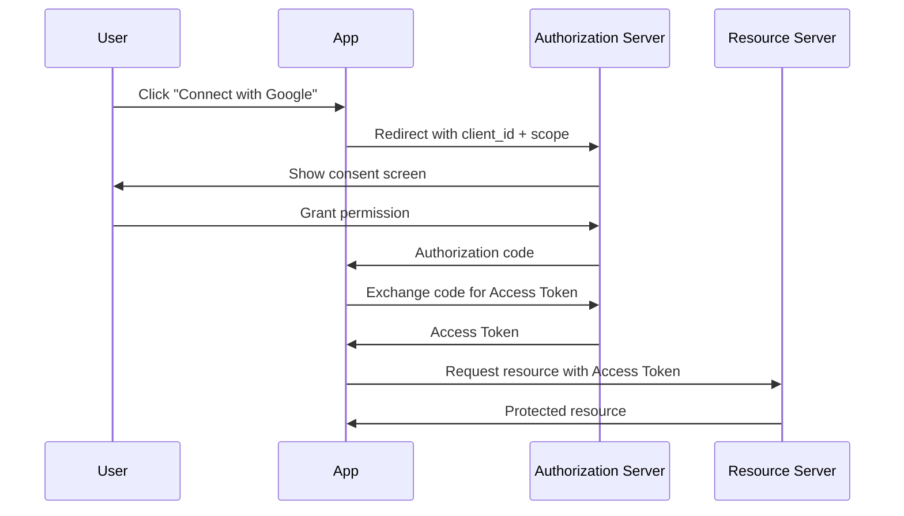
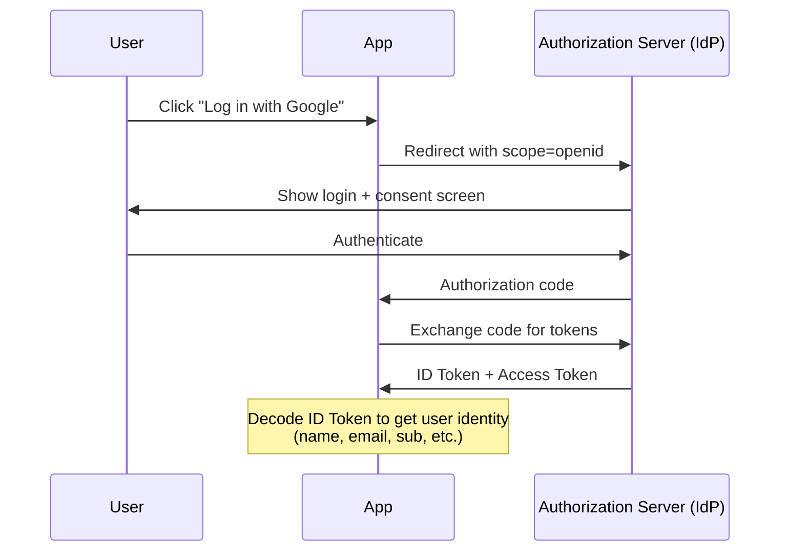
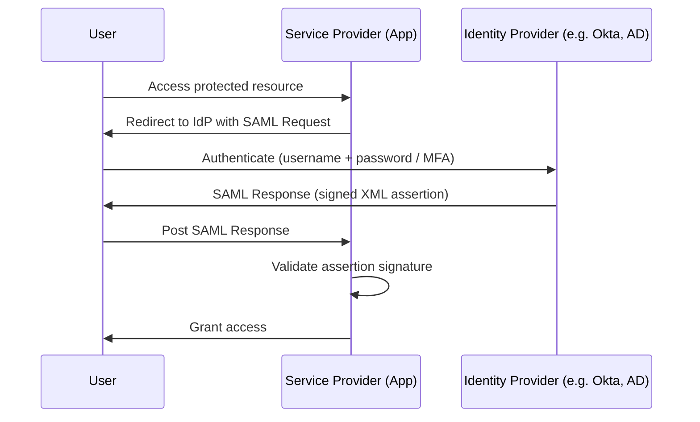

# OAuth vs OIDC vs SAML

Three standards that often come up together, but each solves a different problem.

**OAuth** is about _authorization_ — granting an app limited access to a resource on your behalf, without sharing your password. Think "Allow this app to read your Google Drive."

**OIDC** (OpenID Connect) is about _authentication_ — verifying who you are. It is built on top of OAuth and adds an ID token so the app knows _which_ user just logged in.

**SAML** is an older enterprise standard for _single sign-on (SSO)_. A user logs in once and gains access to all connected applications in an organisation, typically in a corporate environment.

---

|           | What it answers                  | Token type              |
| --------- | -------------------------------- | ----------------------- |
| **OAuth** | Can this app act on your behalf? | Access token            |
| **OIDC**  | Who are you?                     | ID token + Access token |
| **SAML**  | Are you allowed in?              | XML assertion           |

A simple rule of thumb: use **OIDC** (which gives you OAuth too) for modern apps, and **SAML** when integrating with legacy enterprise identity providers.

---

## How each flow works

### OAuth — Authorization Flow

The user grants an app permission to access a resource without sharing their password.

---

### OIDC — Authentication Flow

Built on OAuth. The Authorization Server also issues an ID Token so the app knows _who_ the user is.

---

### SAML — Enterprise SSO Flow

The user authenticates once with the Identity Provider (IdP) and is granted access to multiple Service Providers (SP) via a signed XML assertion.

